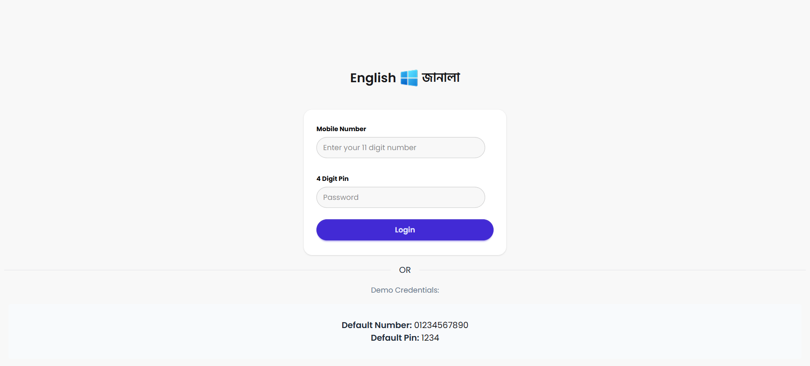
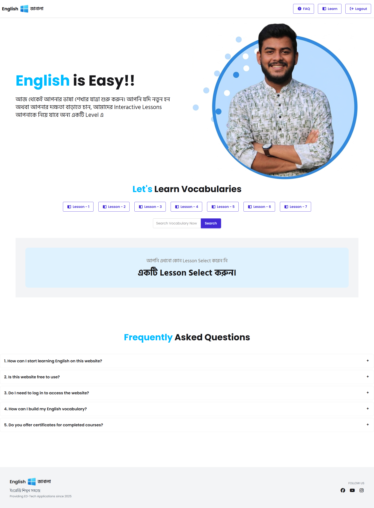
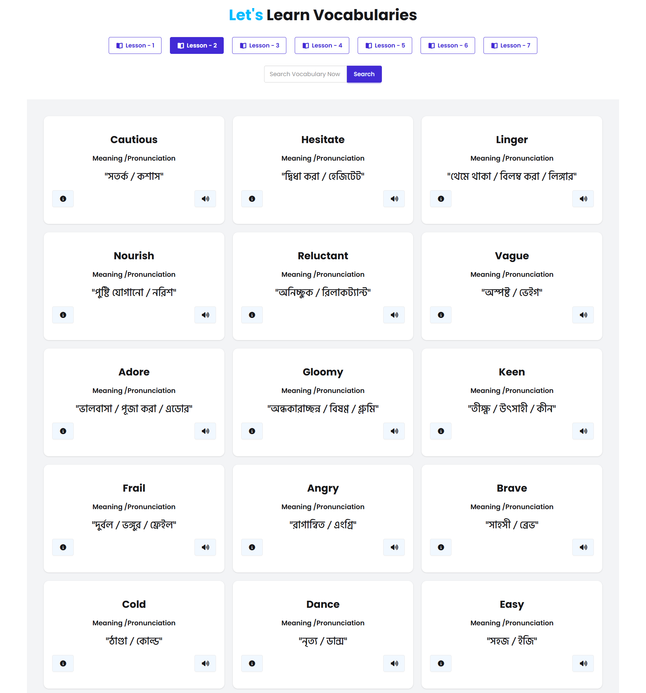
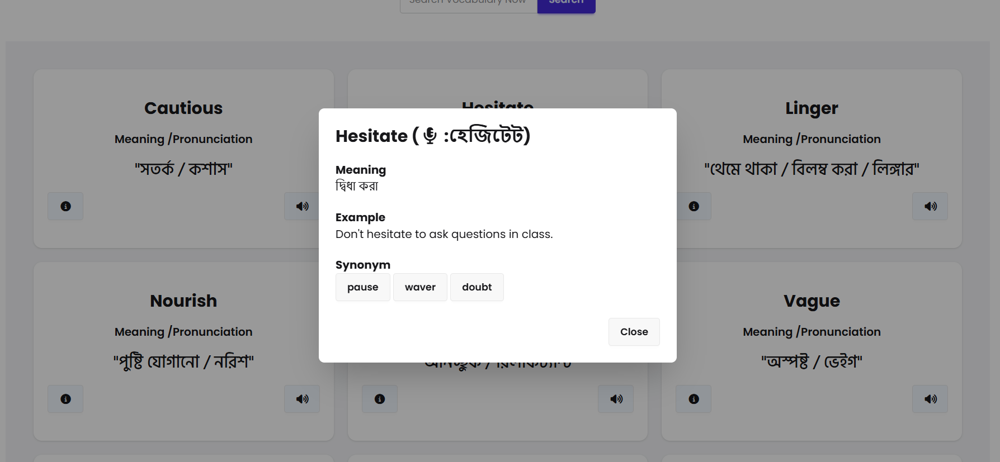

# English Janala

**English Janala** is a dynamic, API-driven vocabulary learning platform designed to make learning English words interactive, fun, and user-friendly. Unlike static UI projects, this platform fetches real-time data and offers features like search, pronunciation, and detailed word insights.

---

## 🚀 Live Demo
Check out the live project here:  
[🌐 English Janala Live](https://english-janala-project-ph.netlify.app/)

---

## ✨ Features

### 🔐 Authentication System
- Login with phone number & PIN
- Success alert on valid credentials
- Restricts access for invalid input

### 📡 API Integration
- Fetches all levels, words, and word details dynamically using Fetch API
- Real-time data updates for lessons

### 🧩 Dynamic Lesson System
- Lessons generated dynamically
- Clicking a lesson loads vocabulary instantly
- Active lesson highlighted for better UX

### 📖 Vocabulary Cards
- Displays Word + Meaning + Pronunciation
- Clean, card-based UI
- Handles empty lessons with custom alerts

### 🔍 Search Functionality
- Real-time word search
- Resets active lesson selection automatically

### 🔊 Voice Feature
- Click the speaker icon to hear word pronunciation

### 📦 Word Details Modal
- Opens on info icon click
- Shows pronunciation, example sentences, and synonyms
- Smooth, interactive user experience

### ⏳ Loading & Error Handling
- Loading spinner while fetching data
- Handles undefined/null values gracefully
- User-friendly fallback messages

---

## 🎨 Tech Stack
- HTML5  
- Tailwind CSS  
- DaisyUI  
- Vanilla JavaScript (ES6+)  

---

## 📌 What I Learned
- Working with multiple API endpoints  
- Dynamic DOM manipulation  
- Handling edge cases for better UX  
- Building interactive UI without frameworks  

---

## ⚡ Future Plans
Currently, I am leveling up my skills in **React.js** to create even more powerful, scalable, and dynamic web applications.

---

## 🖥️ Screenshots

### Login Page

### Home Page

### Lesson Page

### Word Details Modal

---

